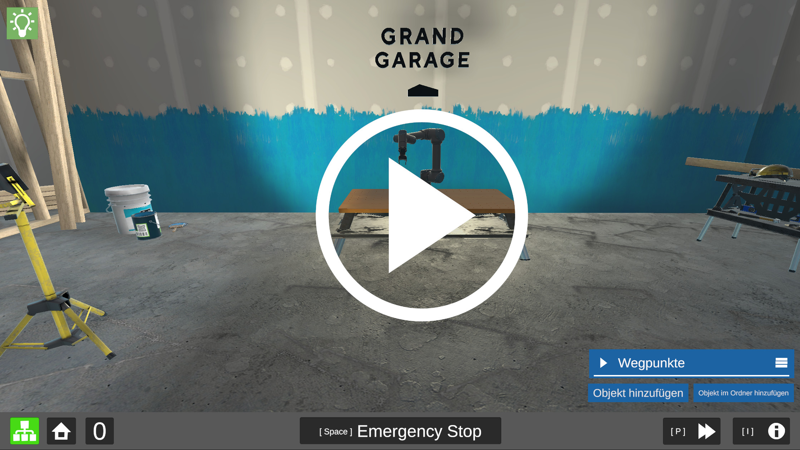
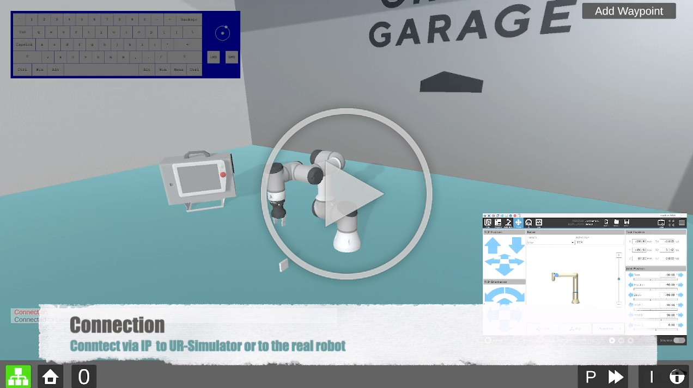
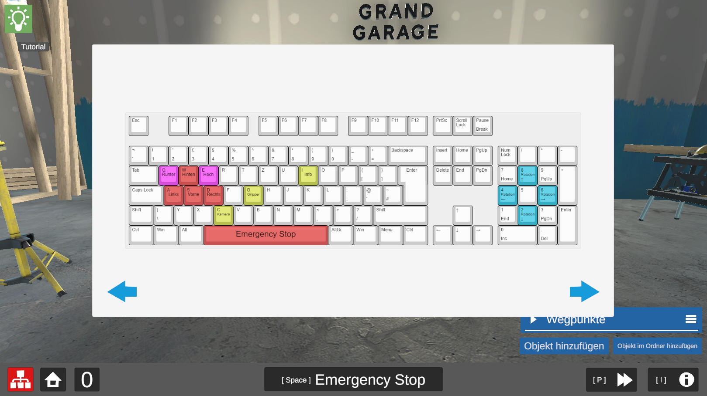
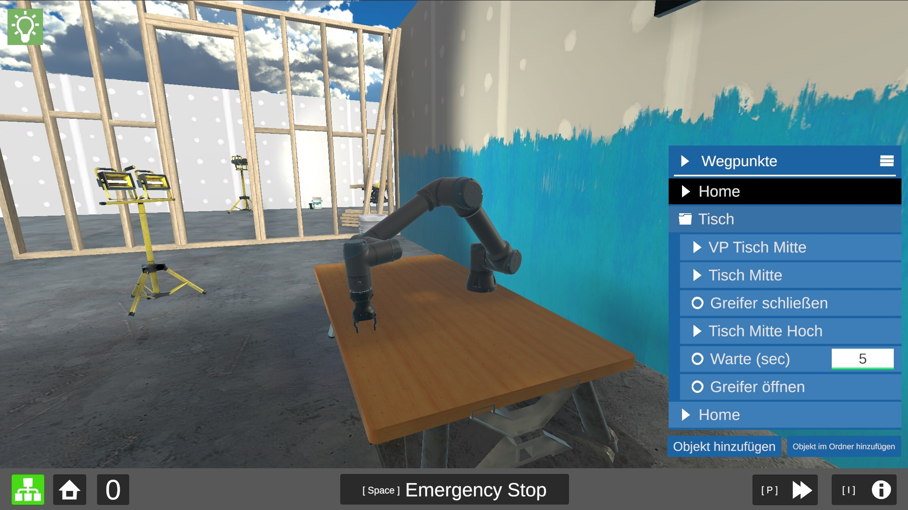
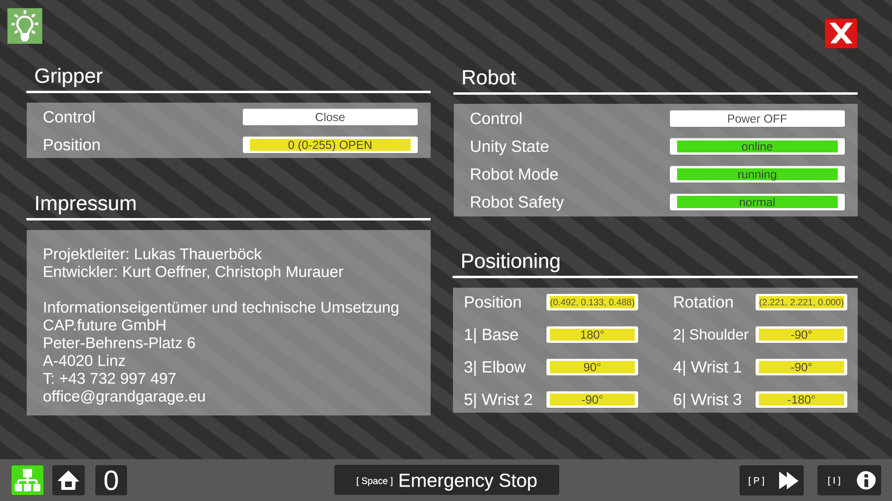

<p align="center">

</p>

# UR - Unity3D Digital Twin
Control the [Universal Robots](https://www.universal-robots.com/) with Unity3D by using **URScript** and a **TCP/IP** communication.

[](https://youtu.be/tatGOp3HRJc "UR Digital Twin showcase")

You can find a documentation of more commands URScript commands in the official [Manual](https://www.universal-robots.com/download/manuals-e-series/script/script-manual-e-series-sw-511/).

**Showcase with PolyScope**
[](https://youtu.be/4BE_jgSYYJU "UR Digital Twin - polyscope showcase")

<br><br>

# Requirements

| Software / Package           | Description / Link                                                                                  |
| -------------------------- | ------------------------------------------------------------------------------------- |
| OS                         | *Linux* or *Windows*
| Unity3D 2020.3.xx          | https://unity3d.com/get-unity/download/archive                                        |
| Docker                     | https://docs.docker.com/get-docker/
| UR Simulator               | https://github.com/vushu/DockURSim                                            |

<br><br>

# Features
## Virtual UR Twin
Use the game engine Unity3D to directly move your UR robot.


## Game Controller Support
Full support for common game controllers, e.g. for Playstation and Xbox.

## Waypoints
Create a simple movement set in an intuitive virtual environment without needing any skills in robotic. 



## User friendly
You will be guided throw a tutorial to lean the controls and more.
All logs from the Robot will be print out in alert boxes. You have full control of brakes and  [Hand-e Grippers from Robotiq](https://robotiq.com/de/produkte/adaptiver-2-finger-robotergreifer-hand-e).



<br><br>

# Quick Start

## I) UR Simulator
1. **Docker:** Install and run [Docker Engine](https://docs.docker.com/get-docker/)
2. **URSim**
    ```
   # Create volume
   docker volume create dockursim
   
   # Run container
    docker run -d \
    --name="dockursim" \
    -e ROBOT_MODEL=UR3 \
    -p 8080:8080 \
    -p 29999:29999 \
    -p 30001-30004:30001-30004 \
    -v /path/to/your/local/ursim/programs:/ursim/programs \
    -v dockursim:/ursim \
    --privileged \
    --cpus=1 \
    arranhs/dockursim:latest
    ```
3. Open http://localhost:8080

<br>

## II) Unity3D

### Connect to UR Sim
1. Make sure [URSim](https://github.com/vushu/DockURSim) is running
2. Connect in Unity to *127.0.0.1*

### Connect to real robot
1. Connect you PC by the ethernet with your robot
2. Configurate your network, e.g.:
    ```
    # Polyscope
      IP: 192.168.0.102
      Subnet: 255.255.255.0
      Gateway: 192.168.0.1
   
    # PC
      IP: 192.168.0.101
      Subnet: 255.255.255.0
      Gateway: 192.168.0.1
   
   # Unity
      IP: 192.168.0.102
       ```

# Sources
* [Realtime Interface documentation (deprecated)](https://s3-eu-west-1.amazonaws.com/ur-support-site/16496/ClientInterfaces_Realtime.pdf)
* [RTDE documentation](https://s3-eu-west-1.amazonaws.com/ur-support-site/22229/Real_Time_Data_Exchange_(RTDE)_Guide.pdf)
* [UR Script documentation](https://s3-eu-west-1.amazonaws.com/ur-support-site/115824/scriptManual_SW5.11.pdf)
* [Gripper Hand-E documentation](https://gitlab.grandgarage.eu/mykyta.ielanskyi/ur5_robot_servo/-/blob/master/moveit2_dualshock_controller/ur_robotiq_gripper/gripper.py)


## License
[MIT](https://choosealicense.com/licenses/mit/)
